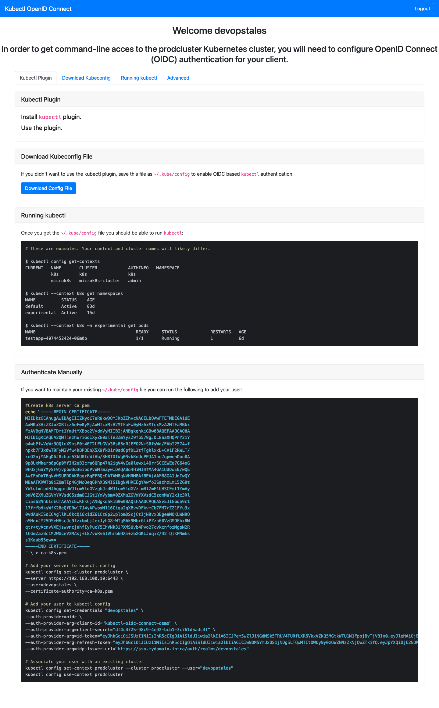

### Kube OpenID Connect

Kube OpenID Connect is an application that can be used to easily enable authentication flows via OIDC for a kubernetes cluster. Kubernetes supports [OpenID Connect Tokens](https://kubernetes.io/docs/reference/access-authn-authz/authentication/#openid-connect-tokens) as a way to identify users who access the cluster. Kube OpenID Connect helps users with it's `kubectl` plugin to authenticate and get `kubectl` config.



### How It Works

Kube OpenID Connect has two main component the server an the `kubectl plugin`. The server is written in python and the `kubectl plugin` in go for easier multi architecture build. When you want to login to a Kubernetes cluster you just simply use the `kubectl login` command to connect to the server component. It will open the OpenID authentication page in you browser. After you successfully logged in the server based on yout `JWT token` generates a `kubectl config` and push back to your `kubectl plugin`, that writes it to your config.

### Deployment

To ease deployment I created a helm chart for kube-openid-connect.

```bash
helm repo add devopstales https://devopstales.github.io/helm-charts
helm repo update

kubectl create ns kubeauth
kubens kubeauth
helm upgrade --install kubelogin devopstales/kube-openid-connect -f values.yaml
```

### Install the Kubectl plugin

```bash
# Homebrew (macOS and Linux)
brew tap devopstales/devopstales
brew install kubectl-login

# Main Krew with differente name (macOS, Linux, Windows and ARM)
kubectl krew install dtlogin

# My krew repo (macOS, Linux, Windows and ARM)
kubectl krew index add devopstales https://github.com/devopstales/krew
kubectl krew install devopstales/login

# My krew repo (macOS, Linux, Windows and ARM)
kubectl krew index add devopstales https://github.com/devopstales/krew
kubectl krew install devopstales/login

# Chocolatey (Windows)
choco install kubectl-login

# Binary release (Windows, macOS and Linux)
https://github.com/devopstales/kube-openid-connect/releases
```

### Use the plugin to login:

Point the url to the ingress of the server component:

```bash
$ kubectl login https://kubeauth.k8s.intra
Configfile created with config for productioncluster to ~/.kube/config
# OR If you installed from main Krew
kubectl dtlogin https://kubeauth.k8s.intra
Happy Kubernetes interaction!
```

### Build executable

```
pip3 install -r requirements.txt
pyinstaller --onefile --noconfirm --noconsole --clean --log-level=WARN --key=MySuperSecretPassword --strip kubectl-login.py
```
